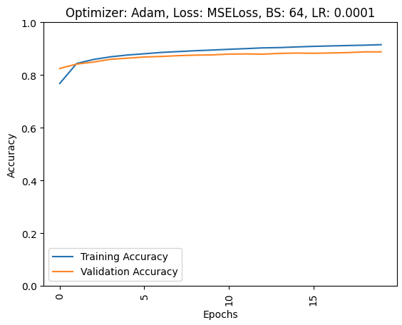
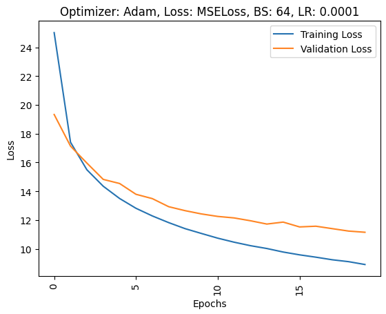
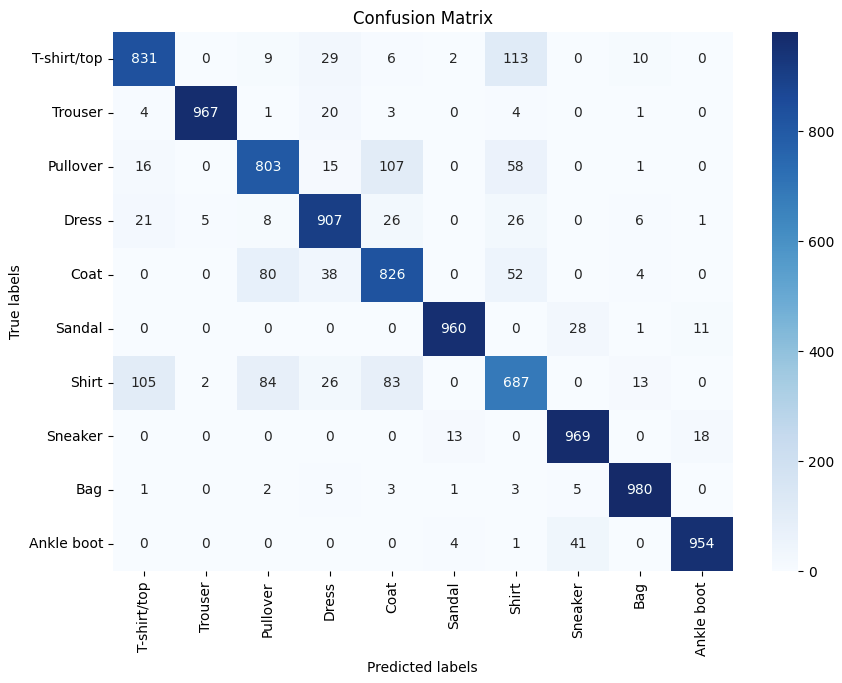
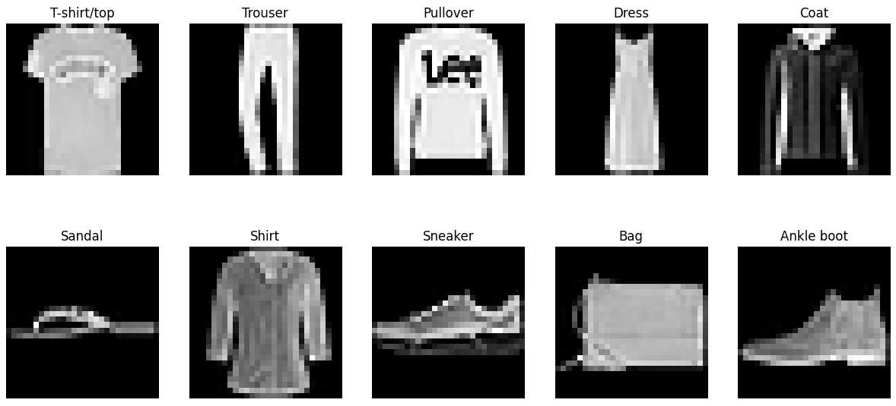
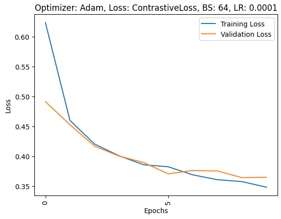
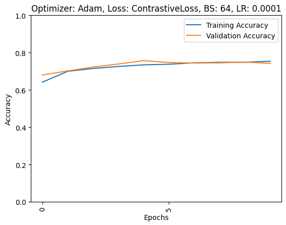

# FashionMNIST Neural Networks (PyTorch)

This repo contains implementations of a neural network classifier and a Siamese Network trained on [FashionMNIST](https://en.wikipedia.org/wiki/Fashion_MNIST) using PyTorch. This project was completed as part of a course assignment

This project was originally completed as part of CMPT 410 at Simon Fraser University in Spring 2025 under instructor Ke Li.

It is shared here as a personal project for portfolio purposes.

## Project Structure
- `a2_classifier.ipynb` – Neural network classifier experiments
- `a2_siamese_net.ipynb` – Siamese Network for image similarity
- `utils.py` – helper functions
- `data/` – dataset (optional: download automatically via PyTorch)

- 
## Results

### Classifier Training & Validation Accuracy

### Classifier Training & Validation Loss

### Classifier Confusion Matrix

### Classifier Class Visualization

## a2_siamese.ipynb Results

### Siamese Network Loss Curve

### Siamese Network Accuracy Curve

